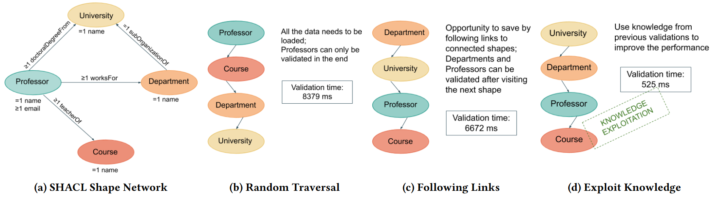

.. |tests| image:: https://github.com/SDM-TIB/Trav-SHACL/actions/workflows/test.yml/badge.svg
.. |release| image:: http://img.shields.io/github/release/SDM-TIB/Trav-SHACL.svg?logo=github
.. |docker| image:: https://img.shields.io/badge/Docker%20Image-sdmtib/travshacl-blue?logo=Docker
.. |license| image:: https://img.shields.io/badge/License-GPLv3-blue.svg
.. |python| image:: https://img.shields.io/pypi/pyversions/TravSHACL
.. |format| image:: https://img.shields.io/pypi/format/TravSHACL
.. |status| image:: https://img.shields.io/pypi/status/TravSHACL
.. |version| image:: https://img.shields.io/pypi/v/TravSHACL

|tests| |release| |docker| |license| |python| |format| |status| |version|

**********
Trav-SHACL
**********

Trav-SHACL is a SHACL engine capable of planning the traversal and execution of a shape schema in a way that invalid entities are detected early and needless validations are minimized.
Trav-SHACL reorders the shapes in a shape schema for efficient validation and rewrites target and constraint queries for fast detection of invalid entities.
The shape schema is validated against an RDF graph accessible via a SPARQL endpoint.

.. _architecture:

   The Trav-SHACL Architecture (from :cite:p:`figuera2021`)

:numref:`architecture` shows the architecture of Trav-SHACL.
Trav-SHACL receives a SHACL shape schema S and an RDF graph G.
The output of Trav-SHACL are the entities of G that satisfy the shapes in S.
The inter-shape planner uses graph metrics computed over the dependency graph of the shape schema.
It orders the shapes in S in a way that invalid entities are identified as soon as possible.
The intra-shape planner and execution optimizes the target and constraint queries at the time the shape schema is traversed.
So-far (in)validated entities are considered to filter out entities linked to these entities; query rewriting decisions (e.g., pushing filters, partitioning of non-selective queries, and query reordering) are made based on invalid entities' cardinalities and query selectivity.
The rewritten queries are executed against SPARQL endpoints.
The answers of the target and constraint queries as well as the truth value assignments are exchanged during query rewriting and interleaved execution.
They are utilized — in a bottom-up fashion — for constraint rule grounding and saturation.
The intra-shape planner and execution component runs until a fixed-point in the truth value assignments is reached.

.. _motivation:

   Motivating Example (from :cite:p:`figuera2021`)

:numref:`motivation` presents the motivating example from the Trav-SHACL paper :cite:p:`figuera2021`.
Part (a) shows a visual representation of a simple SHACL shape schema with four connected shapes.
The parts (b) to (d) show the validation time of the shape schema in different orders.
The order in part (b) is random.
The execution of the validation takes about 8.4 seconds.
Following this order, all the data needs to be loaded and the final decision about Professors can only be made at the very end.
Part (c) shows the benefits of following outgoing links.
The departments and Professors can be validated after finishing the validation of the following shape.
However, the validation is still relatively slow taking 6.7 seconds.
Part (d) presents the order identified by Trav-SHACL.
The chosen order allows Trav-SHACL to make use of the knowledge gained from previously validated shapes.
Hence, Trav-SHACL does not need to check all constraints for all the entities.
Following this order, the validation time is reduced to about 0.5 seconds.

.. _example:
.. figure:: _images/example.png
   :alt: Running Example
   :align: center

   Running Example (from :cite:p:`figuera2021`)

:numref:`example` presents a comparison of Trav-SHACL and the state-of-the-art SHACL2SPARQL :cite:p:`Corman2019,Corman2019b`.
The example uses the SHACL shape schema and best traversal order from :numref:`motivation`.
The data used for the validation is based on the LUBM benchmark :cite:p:`LUBM` and models eight Universities.
Trav-SHACL not only validates the shapes in the selected order, but also pushes the corresponding filters into the SPARQL queries to avoid interleaving entities linked to already invalidated ones.
The knowledge of the eight valid universities allows Trav-SHACL to rewrite the target query of Professors to filter out 1,260 invalid entities from grounding.
This inter- and intra-shape strategy collects a total of 9,282 entities that result in grounding 16,604 rules versus 369,472 rules grounded by SHACL2SPARQL.

.. toctree::
   :hidden:

   library
   service
   feature
   references
