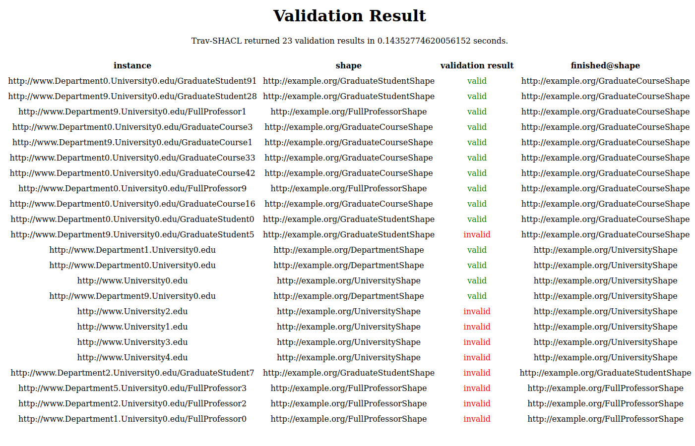

.. |docker| image:: https://img.shields.io/badge/Docker%20Image-sdmtib/travshacl-blue?logo=Docker
   :target: https://hub.docker.com/r/sdmtib/travshacl

|docker|

#######################
Trav-SHACL as a Service
#######################

*****************
Getting the Image
*****************

If you want to run Trav-SHACL as a service, you can build the Docker image from its source code or download the Docker image from DockerHub.

Requirements
============

.. |python| image:: https://img.shields.io/pypi/pyversions/TravSHACL

Trav-SHACL is implemented in Python3.
The current version supports |python|.
Trav-SHACL uses the ``rdflib`` library for parsing the SHACL shape schema and the ``SPARQLWrapper`` library for contacting SPARQL endpoints.
The Web API is powered by ``flask``.
In order to run Trav-SHACL as a service, you need to have `Docker <https://docs.docker.com/engine/install/>`_ installed.

Local Source Code
=================

You can install Trav-SHACL from your local source code by performing the following steps.

.. code:: bash

   git clone git@github.com:SDM-TIB/Trav-SHACL.git
   cd Trav-SHACL
   docker build . -t sdmtib/travshacl

DockerHub
=========

The easiest method is to download the latest Docker image from DockerHub:

.. code:: bash

   docker pull sdmtib/travshacl:latest

*******
Example
*******

You can run Trav-SHACL over example data provided in the GitHub repository.
While it is necessary to clone the repository (or download the example folder) from GitHub, you do not need to build the Docker image yourself.

Assuming your current working directory contains the ``example`` folder, you can start the necessary Docker containers as shown below:

.. code:: bash

   docker-compose -f ./example/docker-compose.yml up -d

This will create two Docker containers:

* ``travshacl_example_data`` serving the example data as a SPARQL endpoint
* ``travshacl_example_engine`` serving Trav-SHACL itself

.. NOTE::

   The SPARQL endpoint might take a few seconds in order to be started.
   You can check its accessibility by navigating to `http://localhost:9090/sparql <http://localhost:9090/sparql>`_

The Trav-SHACL service is accessible at `http://localhost:9091/validate <http://localhost:9091/validate>`_.
The current version of the interface has only two inputs:

* ``Validate integrity constraints in`` the path to the SHACL shape schema within the Docker container
* ``Endpoint`` URL of the SPARQL endpoint to be evaluated; must be accessible from within the Docker container

You can run the example by setting the path to the SHACL shapes to ``/shapes/LUBM`` and the endpoint URL to ``http://travshacl_example_data:8890/sparql``.
After pressing the ``Validate`` button, Trav-SHACL starts the validation.
Once the validation is done, the result will be displayed in form of a table.

The column ``instance`` shows the entity for which the satisfaction of the SHACL constraints is reported.
The ``shape`` column indicates to which shape of the shape schema the entity belongs.
The validation result is reported in the column ``validation result``.
Valid entities have a green entry ``valid`` while violations are marked with a red ``invalid``.
The focus shape, i.e., the shape that was validate when the decision for the entity was made, is included in the column ``finished@shape``.
